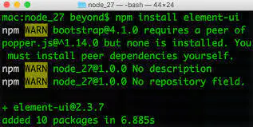

#### npm 依赖管理

- peerDependencies
  [peerDependencies](https://www.jianshu.com/p/e8fec377eeb8)

  ` // 假设我们当前的项目是MyProject，项目中有一些依赖，比方其中有一个依赖包PackageA，该包的package.json文件指定了对PackageB的依赖`

  ```json
  {
    "dependencies": {
      "PackageB": "1.0.0"
    }
  }
  ```

  `如果我们在我们的MyProject项目中执行npm install PackageA, 我们会发现我们项目的目录结构会是如下形式`

  ```bash

  MyProject
  |- node_modules
    |- PackageA
        |- node_modules
          |- PackageB

  ```

`那么在我们的项目中，我们能通过下面语句引入"PackageA"：`

```javascript
var packageA = require("PackageA");
```

`但无法在项目中直接引用PackageB, 因为Node只会在“MyProject/node_modules”目录下查找PackageB，它不会在进入PackageA模块下的node_modules下查找。`

---

`为此, 引入 peerDependencies`

`上面的PackageA的package.json文件如果是下面这样：`

```json
{
  "peerDependencies": {
    "PackageB": "1.0.0"
  }
}
```

`它会告诉npm：如果某个package把我列为依赖的话，那么那个package也必需应该有对PackageB的依赖`
`如果你`npm install PackageA`，你将会得到下面的如下的目录结构：`

```bash

MyProject
|- node_modules
   |- PackageA
   |- PackageB

```

`peerDependencies的目的是提示宿主环境去安装满足插件peerDependencies所指定依赖的包，然后在插件import或者require所依赖的包的时候，永远都是引用宿主环境统一安装的npm包，最终解决插件与所依赖包不一致的问题。`

- npm2 vs npm3

`在npm2中，PackageA包中peerDependencies所指定的依赖会随着npm install PackageA一起被强制安装，所以不需要在宿主环境的package.json文件中指定对PackageA中peerDependencies内容的依赖。`

```bash
  npm3中不会再要求peerDependencies所指定的依赖包被强制安装，相反npm3会在安装结束后检查本次安装是否正确，如果不正确会给用户打印警告提示。
```

`如果我们npm install PackageA安装PackageA时，你会得到一个警告提示说：`

`npm3的项目中，可能存在一个问题就是你所依赖的一个package包更新了它peerDependencies的版本，那么你可能也需要在项目的package.json文件中手动更新到正确的版本。否则会出现类似下图所示的警告信息`



#### package.json

[package-json](https://docs.npmjs.com/cli/v7/configuring-npm/package-json)

- devDependencies

  `If someone is planning on downloading and using your module in their program, then they probably don't want or need to download and build the external test or documentation framework that you use.In this case, it's best to map these additional items in a devDependencies object.These things will be installed when doing npm link or npm install from the root of a package, and can be managed like any other npm configuration param. See config for more on the topic.For build steps that are not platform-specific, such as compiling CoffeeScript or other languages to JavaScript, use the prepare script to do this, and make the required package a devDependency.`

  ```json
  {
    "name": "ethopia-waza",
    "description": "a delightfully fruity coffee varietal",
    "version": "1.2.3",
    "devDependencies": {
      "coffee-script": "~1.6.3"
    },
    "scripts": {
      "prepare": "coffee -o lib/ -c src/waza.coffee"
    },
    "main": "lib/waza.js"
  }
  ```

  - engines

  `Specify the version of node that the stuf work on`

  ```json
  {
    "engines": {
      "node": ">=0.10.3 <15"
    }
  }
  ```
