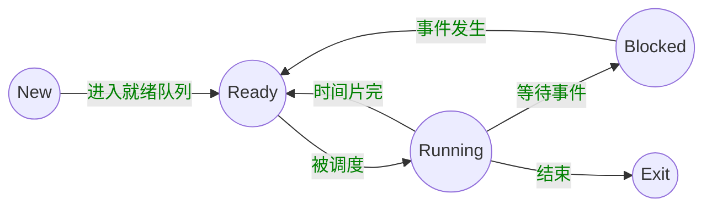
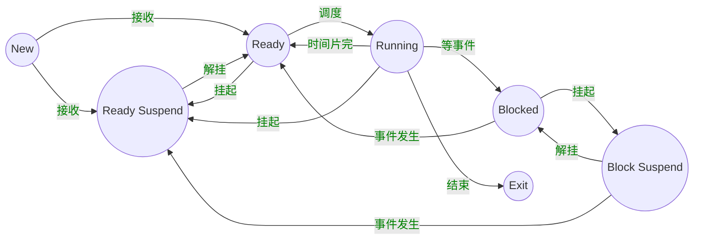

#### 操作系统特征

- 并发

  (注意区分`并行`和`并发`)

- 共享

- 虚拟

- 异步


#### 顶级会议

- SOSP
- USENIX


操作系统需要权衡

- 空间与时间
- 性能和可预测性
- 公平和性能


多道程序设计


分时系统 -- 分时操作系统 

(轮流切换) (定时器中断)


DISK: 存放OS

BIOS(basic input output system): 基本I/O处理系统

Bootloader: 加载os

POST(加电自检)寻找显卡和执行BIOS


#### 系统调用、异常、中断

- 系统调用(来源于程序)
  - 应用程序主动向os发出服务请求
- 异常(来源于不良的应用程序)
  - 非法指令或者其他坏的处理状态(eg: 内存出错)
- 中断(来源于外设)
  - 来自不同的硬件设备的计时器和网络的中断


计算机运行中，内核是被信任的第三方

只有内核可以执行特权指令


- 源头
  - 中断: 外设
  - 异常: 应用程序意想不到的行为
  - 系统调用: 应用程序请求操作提供服务

- 处理时间
  - 中断: 异步(不知道什么时候产生)
  - 异常: 同步 (特定指令触发)
  - 系统调用: 异步或同步(返回时间为例：发出的请求点是同步的，发出请求的返回点是异步/同步的)

- 响应
  - 中断：持续，对用户应用程序是透明的
  - 异常: 杀死或者重新执行意想不到的应用程序指令
  - 系统调用: 等待和持续


中断:

 - 硬件
      - 设置中断标记[CPU初始化]
        		 - 将内部、外部事件设置中断标记
              		 - 中断事件ID

- 软件
  - 保存当前处理状态
  - 中断服务程序处理
  - 清除中断标记
  - 恢复之前保存的处理状态


异常: 异常编号

- 保存现场
- 异常处理
  - 杀死产生了异常的程序
  - 重新执行异常指令
- 恢复现场


##### 系统调用接口

举例

```bash
## 应用程序调用 printf()时, 会触发系统调用 write()。

printf 会触发一条指令 --> write 系统调用 --> write 系统调用带部分参数 --> os获取参数 --> 访问对应设备(屏幕) --> 屏幕显示结果
   
```


- 程序访问主要是通过高层次的API


- Win32 API 用于 Windows

- POSIX API 用于 POSIX-based systems (包括UNIX, LINUX, Mac OS X的所有版本)

- Java API 用于 JAVA虚拟机(JVM) (底层还是win32/ POSIX)


应用程序通常通过 library 库访问系统调用的接口，从而触发从`用户态`到`内核态`的转化

##### 

- 用户态: 应用程序执行过程中 CPU所处的特权级状态, 特权级很低，不能访问一些特殊的机器指令以及直接访问IO

- 内核态: 操作系统运行过程中 CPU所处的状态， 该状态下，操作系统可以执行任何指令，CPU可以提供任何一条指令 (完全控制整个计算机系统)

当一个应用程序完成一个系统调用时，会完成从用户态到内核态的转换，控制权转化

操作系统通过任务标识完成相关工作


当应用程序完成`函数调用`时，是在一个栈空间，完成参数传递和结果返回

当应用程序完成`系统调用`时，应用程序和操作系统在不同堆栈，需要堆栈切换，用户态转换成内核态  开销较大，但安全可靠 (why????)


跨越操作系统边界的开销

- 在执行时间上的开销超过程序调用

- 开销:  (值得 必须)

  - 建立中断/异常/系统调用信号与对应服务

    例程映射关系的初始化开销 (操作系统有自己的映射关系表)

  - 建立内核堆栈

  - 验证参数 (操作系统不信任应用程序)

  - 内核态映射到用户态的地址空间

    更新页面映射权限

  - 内核态独立地址空间

    TLB


#### 地址空间

物理地址空间 ---- 硬件支持的地址空间

​	- 起始地址0， 到地址MAXsys

逻辑地址空间 ---- 一个运行的程序所拥有的内存范围

- 起始地址 0， 到地址MAXprop


映射

逻辑地址 <----> 物理地址

<b>LA</b>                      <b>PA</b>


##### 连续内存分配

分区的动态分配

- 当一个程序准许运行在内存中时，分配一个连续的区间
- 分配一个连续的内存区间给运行的程序以访问的数据

分配策略

- 首次适配   first fit: 从头开始找，够大就可以放进去
- 最优适配   best fit: 对所有空闲分区排序，选择能满足的最小分区
- 最差适配   worst fit: 使用最大空闲块
- next fit: 从上次查找结束的地方开始继续搜索解决方案


##### 压缩式碎片整理

- 重置程序以合并孔洞
- 要求所有程序是动态可重置的
- Q： 
  - 何时重置
  - 开销

##### 交换式碎片整理

- 运行程序需要更多的内存
- 抢占等待的程序 & 回收他们的内存


主存         磁盘(虚拟内存)


非连续内存

`映射机制`

- 分段
  - 程序的分段地址空间
  - 分段寻址方案

##### 段访问机制

一个段， 一个内存“块”

 - 一个逻辑地址空间

程序访问内存地址需要

一个2维的二元组(s, addr) （segement, address）

 -	s — 段号
 -	addr — 段内偏移 

段寄存器 + 地址寄存器 实现方案

单地址 实现方案

- 分页


- 划分`物理内存`至固定大小的`帧` （frame）
  - 大小是2的幂

- 划分`逻辑地址`空间至相同大小的`页` (page)
  - 大小是2的幂


##### 帧（Frame)    //TODO: 如何理解？？？？

一个内存物理地址是一个二元组(f,o)

f — 帧号（F位，共有2^F个帧）

o —帧内偏移 （S位，每帧有2^S字节）

物理地址 = 2^S x f + o


##### 页

- 一个程序的逻辑地址空间被划分成大小相等的页
  - 页内偏移的大小 = 帧内偏移的大小
  - 页号大小 <> 帧号大小

一个逻辑地址是一个二元组（p,o)

p ---- 页号（p位， 2^P个页）

o ---- 页内偏移 (S位，每页有2^S字节)

虚拟地址 = 2^S p + o


页寻址机制 （逻辑 <---->物理）

- 页映射到帧
- 页是连续的虚拟内存
- 帧是非连续的物理内存
- 不是所有的页都有对应的帧


页表

- 每个运行的程序都有一个页表
  - 属于程序运行状态，会动态变化
  - PTBR：页表基址寄存器

页表项的内容

- Flags(标志位)
  - dirty bit
  - resident bit
  - clock/reference bit
- 帧号: f


#### 覆盖技术

目标: 

- 较小的可用内存中运行较大的程序。常用于多道程序系统，与分区存储管理配合使用

原理

- 把程序按照其自身逻辑结构，划分为若干个功能上相对独立的程序模块，那些不会同时执行的模块共享同一块内存区域，按时间先后来运行
  - 必要部分(常用功能)的代码和数据常驻内存
  - 可选部分(不常用功能)在其他程序模块中实现，平时存放在外存中，在需要用到时才装入内存
  - 不存在调用关系的模块不必同时装入到内存，从而可以相互覆盖，即这些模块共用一个分区。
- 缺点
  - 由程序员来把一个大的程序划分为若干个小的功能模块，并确定各个模块之间的覆盖关系，费时费力，增加了编程的复杂度。
  - 覆盖模块从外存装入内存，实际上是以时间延长来换取空间节省。


#### 交换技术

目标：

- 多道程序在内存中，让正在运行的程序或需要运行的程序获得更多的内存资源

方法

- 可将暂时不能运行的程序送到外存，从而获得空闲内存空间
- 操作系统把一个进程的整个地址空间的内容存到外存中(换出 swap out), 而将外存中的某个进程的地址空间读入到内存中(换入 swap in)。 换入换出内容的大小为整个程序的地址空间。

存在问题

- 交换时机的确定: 何时需要发生交换？ 只当内存空间不够或有不够的危险时换出
- 交换区的大小：必须足够大以存放所有用户进程的所有内存映像的拷贝；必须能对这些内存映像进行直接存取
- 程序换人时的重定位：换出后再换入的内存位置一定要在原来的位置上吗？ 最好采用动态地址映射的方法。


##### 覆盖与交换的比较

- 覆盖只能发生在那些相互间没有调用关系的程序模块之间，因此程序员必须给出程序内的各个模块间的逻辑覆盖结构
- 交换技术是以在内存中的程序大小为单位来进行的，不需要程序员给出各个模块之间的逻辑覆盖结构。交换发生在内存中程序与管理程序或操作系统之间，而覆盖发生在运行程序的内部。


#### 虚存技术

程序的局部性原理： 程序在执行过程中的一个较短时期，所执行的指令地址和指令的操作数地址，分别局限于一定区域。 ？？？ 暂时无法理解

- 时间局限性： 一条指令的一次执行和下次执行，一个数据的一次访问和下次访问都集中在一个较短的时期内
- 空间局限性：当前指令和邻近的几条指令，当前访问的数据和邻近的几个数据都集中在一个较小区域内。


#### 进程

一个具有一定独立功能的程序在一个数据集合上一次动态执行的过程

组成

- 程序的代码

- 程序处理的数据

- 程序计数器中的值，指示下一条运行的指令

- 一组通用的寄存器的当前值，堆、栈

- 一组系统资源（入打开的文件）

  总之，进程包含了正在运行的一个程序的所有状态信息。

程序与进程的联系

- 程序是产生进程的基础
- 程序的每次运行构成不同的进程
- 进程是程序功能的体现 
- 通过多次执行，一个程序可对应多个进程: 通过调用关系，一个进程可包括多个程序

进程与程序的区别

- 进程是动态的，程序是静态的: 程序是有序代码的集合；进程是程序的执行，进程有核心态/用户态
- 进程是暂时的，程序是永久的: 进程是一个状态变化的过程，程序可长久保存
- 进程与程序的组成不同: 进程的组成包括程序、数据和进程控制块（即进程状态信息）

进程特点

- 动态性：可动态地创建、结束进程
- 并发性：进程可以被独立调度并占用处理机运行   （并发: 一个时间段内 多个程序，有先后；并行：同一时刻多个）
- 独立性：不同进程的工作不相互影响
- 制约性：因访问共享数据/资源或 进程间同步而产生制约


#### 进程控制结构

进程控制块：操作系统管理控制进程运行所用的信息集合。  操作系统用PCB来描述进程的基本情况以及运行变化的过程，`PCB`是进程存在的唯一标志。


###### 进程标识信息 

本进程的标识，本进程的产生者标识(父进程标识)；用户标识

###### 处理状态信息保护区

保存进程的运行现场信息

- <font color=green>用户可见寄存器</font>, 用户程序可使用的数据， 地址等寄存器 
- <font color=green>控制和状态寄存器</font> 如程序计数器(PC), 程序状态字(PSW)。
- <font color=green>栈指针</font> 过程调用/系统调用/中断处理和返回时需要用到

###### 进程控制信息

- <font color=green>调度和状态信息</font> 用于OS调度进程并占用处理机使用
- <font color=green>进程间通信信息</font> 为支持进程间的与通信相关的各种标识、信号、信件等，这些信息存放在接收方的进程控制块中。
- <font color=green>存储管理信息</font> 包含指向本进程映像存储空间的数据结构
- <font color=green>进程所用资源</font> 说明由进程打开、使用的系统资源，如打开的文件等
- <font color=green>有关数据结构连接信息</font> 进程可以连接到一个进程队列中，或连接到相关的其他进程的PCB

####  <font color=green>PCB的组织方式</font>

<font color=green> 链表:</font> 同一状态的进程其PCB成一链表，多个状态对应多个不同的链表

​	各状态的进程形成不同的链表: 就绪链表、阻塞链表

<font color=green>索引表: </font> 同一状态的进程归入一个index表(由index指向PCB), 多个状态对应多个不同的index表

​    各状态的进行形成不同的索引表: 就绪索引表、阻塞索引表


##### 进程状态

1. 进程的生命周期管理
   - 进程创建
   - 进程运行
   - 进程等待
   - 进程唤醒
   - 进程结束

<font color=green>进程创建</font>

- 系统初始化时
- 用户请求创建一个新进程
- 正在运行的进程执行了创建进程的系统调用


<font color=green>进程运行</font>

内核选择一个就绪的进程，让它占用处理机并执行


<font color=green>进程等待</font>

(以下情况下，进程等待(阻塞)):

1. 请求并等待系统服务，无法马上完成
2. 启动某种操作，无法马上完成
3. 需要的数据没有达到


进程只能自己阻塞自己，因为只有进程自身才能知道何时需要等待某种事情的发生


<font color=green>进程唤醒</font>

原因

1. 被阻塞进程需要的资源可被满足
2. 被阻塞进程等待的事件到达
3. 将该进程的PCB插入到就绪队列

<b>进程只能被别的进程或操作系统唤醒</b>


<font color=green>进程结束</font>

- 正常退出(自愿的)
- 错误退出(自愿的)
- 致命错误(强制性的)
- 被其他进程所杀(强制性的)

<center><font color=green>状态变化图</font></center>




NULL -> New: 一个新进程被产生出来执行一个程序

New -> Ready: 当进程被创建完成并初始化后，一切就绪准备进行时，变为就绪状态。

Ready -> Running：处于就绪状态的进程被进程调度程序选中后，就分配到处理机上来运行

Running -> Exit：当进程表示它已经完成或者因出错，当前运行进程会由操作系统作结束处理

Running -> Ready：处于运行状态的进程在其运行过程中，由于分配给它的处理时间片用完而让出处理机

Running -> Blocked： 当进程请求某样东西且必须等待时。

Blocked -> Ready： 当进程要等待某件事到来时，它从阻塞状态变到就绪状态


##### <font color=green>进程挂起</font>

进程在挂起状态时，意味着进程没有占用内存空间。处在挂起状态的进程映像在磁盘上。




##### <font color=green>挂起状态</font>

- 阻塞挂起状态 (Blocked-suspend)：进程在外存(磁盘)并等待某件事的出现；
- 就绪挂起状态(Ready-suspend): 进程在外存，但只要进入内存，即可运行；


###### 挂起 (Suspend)： 

把一个进程从内存转到外存; 

存在以下

- 阻塞到阻塞挂起: 没有进程处于就绪状态或就绪进程要求更多内存资源时，会进行这种转换，以提交新进程或运行就绪进程、
- 就绪到就绪挂起:  当有高优先级阻塞 (系统认为会很快就绪的)进程和低优先就绪进程时，系统会选择挂起低优先级就绪进程。
- 运行到就绪挂起: 对抢先式分时系统，当有高优先级阻塞挂起进程因事件出现而进入就绪挂起时，系统可能会把运行进程转到就绪挂起状态


在外存时的状态转换

- 阻塞挂起到就绪挂起: 当有阻塞挂起进程因相关事件出现时，系统会把阻塞挂起进程转换为就绪挂起进程。


##### <font color=green>Thread</font>

`进程当中的一条执行流程`

- 资源组合的角度: 进程把一组相关的资源组合起来，构成了一个资源平台(环境)，包括地址空间(代码段、数据段)、打开的文件等各种资源
- 运行的角度: 代码在这个资源平台上的一条执行流程(线程)


<center><b><font color=green>线程 = 进程 ---- 共享资源</font></b></center>

##### 线程的优点:

- 一个进程中可以同时存在多个线程
- 各个线程之间可以并发地执行
- 各个线程之间可以共享地址空间和文件等资源

##### 线程的缺点

- 一个线程崩溃，会导致其所属进程的所有线程崩溃


<center><b><font color=green>进程与线程的比较</font></b></center>

- 进程是资源分配单位，线程是CPU调度单位
- 进程拥有一个完整的资源平台，而线程只独享必不可少的资源，如寄存器和栈
- 线程同样具有就绪、阻塞和执行三种基本状态，同样具有状态之间的转换

- 线程能减少并发执行的时间和空间开销:
  - 线程的创建时间比进程短；
  - 线程的终止时间比进程短；
  - 同一进程内的线程切换时间比进程短
  - 由于同一进程的各线程间共享内存和文件资源，可直接进行不通过内核的通信；


线程实现

<font color=green>用户线程:</font> 在用户空间实现;

POSIX Pthreads, Mach C-threads, Solaris threads

<font color=green>内核线程:</font> 在内核中实现

Windows, Solaris, Linux

<font color=green>轻量级线程:</font> 在内核中实现，支持用户线程

Solaris  (LightWeight Process)


<center><font color=green><b>用户线程与内核线程的对应关系</b></font></center>

- 多对一  (多个 user thread 对应 一个 kernel thread)
- 一对一 (一个 user thread 对应一个 kernel thread)
- 多对多 (n个 user thread 对应 m个 kernel thread)


<center><font color=green><b>用户线程</b></font></center>

在用户空间实现的线程机制, 它不依赖于操作系统的内核，由一组用户级的线程库函数来完成线程的管理，包括进程的创建、终止、同步和调度等。

- 由于用户线程的维护由相应进程来完成（通过线程库函数），不需要操作系统内核了解用户线程的存在，可用于不支持线程技术的多进程操作系统;
- 每个进程都需要它自己私有的线程控制块(TCB)列表, 用来跟踪记录它的各个线程的状态信息（PC, 栈指针，寄存器）, TCB由线程库函数来维护;
- 用户线程的切换也是由线程库函数来完成，无需用户态/核心态切换，所以速度特别快; 
- 允许每个进程拥有自定义的线程调度算法


##### 用户线程缺点

- 阻塞性的系统调用如何实现? 如果一个线程发起系统调用而阻塞，则整个进程在等待;
- 当一个线程开始运行后，除非它主动地交出CPU的使用权, 否则它所在的进程当中的其他线程将无法运行;
- 由于时间片分配给进程，故与其它进程比，在多线程执行时，每个线程得到的时间比较少，执行会较慢


<center><font color=green><b>内核线程</b></font></center>

指在操作系统的内核当中实现的一种线程机制，由操作系统的内核来完成线程的创建、终止和管理。

- 在支持内核线程的操作系统中，由内核来维护进程和线程的上下文信息(PCB和TCB);
- 线程的创建、终止和切换都是通过系统调用/内核函数的方式来进行, 由内核来完成，因此系统开销较大
- 在一个进程中，如果某个内核线程发起系统调用而被阻塞，并不会影响其他内核线程的运行;
- 时间片分配给线程，多线程的进程获得更多CPU时间
- Windows NT 和 Windows 2000/XP 支持内核线程


<center><font color=green><b>轻量级线程（LightWeight Process）</b></font></center>

它是内核支持的用户线程。一个进程可有一个或多个轻量级进程，每个量级进程由一个单独的内核线程来支持。（Solaris/Linux)


上下文切换

- 操作系统为活跃进程准备了进程控制块（PCB)
- 操作系统将进程控制块（PCB)放置在一个合适的队列里
  -  就绪队列
  - 等待`I/O`队列(每个设备的队列)
  - 僵尸队列

```c
main()
    ...
int pid = fork(); // 创建子进程
if (pid === 0) { // 子进程继续
    exec_status = exec("calc", argc, argv0, argv1, ...);
    printf("why would I execute");
} else { // 父进程在这里继续
    printf("who's your daddy?");
    ...
    child_status = wait(pid);
}

if (pid < 0) {
    /* error occured */
}
```


##### 实时调度

- 定义
  - 正确性依赖于其时间和功能两方面的一种操作系统

- 性能指标
  - 时间约束的及时性（deadlines）
  - 速度和平均性能相对不重要
- 主要特性
  - 时间约束的可预测性


- 强实时系统
  - 需要在保证的时间内完成重要的任务，必须完成
- 弱实时系统
  - 要求重要的进程的优先级更高，尽量完成，并非必须

- 任务 （工作单元）
  - 一次计算，一次文件读取，一次信息传递等等
- 属性
  - 取得进展所需的资源
  - 定时参数

- 硬时限
  - 如果错过了最后期限，可能会发生灾难或非常严重的后果
  - 必须验证: 在最坏的情况下也能够满足时限
  - 保证确定性
- 软时限
  - 理想情况下, 时限应该被最大满足。如果有时限没有被满足，那么就相应的降低要求。
  - 尽最大努力保证
- 表示一个实时系统是否能够满足deadline要求
  - 决定实时任务执行的顺序
  - 静态优先级调度
  - 动态优先级调度
- 多处理器的CPU调度
  - 多个相同的单处理器组成一个多处理器
  - 优点: 负载共享
- 对称多处理器(SMP)
  - 每个处理器运行自己的调度程序
  - 需要在调度程序中同步


进程/线程

- 共享资源
  - 一台电脑，多个用户
  - 一个银行存款余额，多台ATM机
  - 嵌入式系统 (机器人控制: 手臂和手的协调)
- 加速
  - I/O操作和计算可以重叠
  - 多处理器 - 将程序分成多个部分并行执行
- 模块化
  - 将大程序分解成小程序
    - 以编译为例，gcc会调用cpp
  - 使系统易于扩展


上下文切换会保存寄存器值， 从进程2切换到进程1的时候Reg1的值还是100， 所以进程1 完成的时候 next_pid 是 101 但这时已经完成了进程1 和 进程2 的 PID分配 next_pid 应为 102


<font color=red>Race Condition (竞态条件)</font>

- 系统缺陷: 结果依赖于并发执行或者事件的顺序/时间
  - 不确定性
  - 不可重现
- 如何避免竞态
  - 让指令不被打断

<font color=red>Atomic Operation (原子操作)</font>

- 原子操作指一次不存在任何中断或者失败的执行
  - 该执行成功结束
  - 或者根本没有执行
  - 并且不应该发现任何部分执行的状态
- 实际上操作往往不是原子的
  - 有些看上是，实际不是
  - 连 i++ 都是由 3 条指令构成
  - 有时单条机器指令都不是原子
    - Pipeline, super-scalar, out-of-order, page fault


##### Example

- A和B两个线程互相竞争
  - 其中一个尝试使用一个共享的计数器加1
  - 另外一个尝试使用一个共享的计数器减1

```c
// 共享全局变量 i
// 线程A 

i = 0;
while (i < 10)
    i = i + 1;
printf("A win"); 

// 线程B
i = 0;
while (i > -10)
    i = i - 1;
printf("B wins!");

// 假设内存读取和 

    
```

