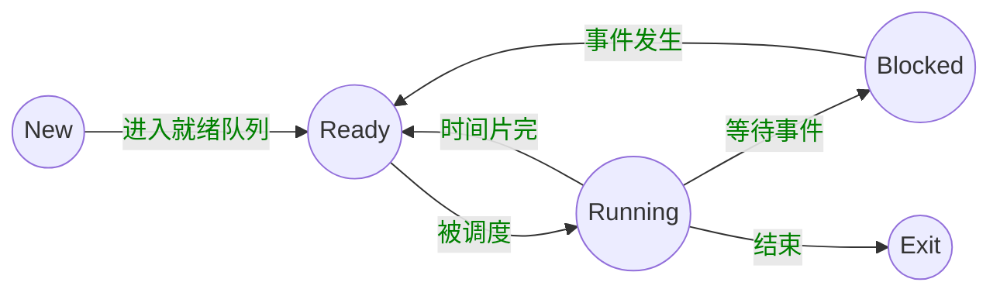
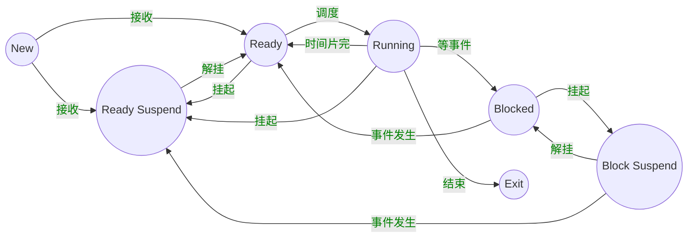

I hear and I forget. I see and I remember. I do and I understand.

不闻不若闻之，闻之不若见之，见之不若知之，知之不若行之


#### 操作系统特征

- 并发

  (注意区分`并行`和`并发`)

- 共享

- 虚拟

- 异步


#### 顶级会议

- SOSP
- USENIX


操作系统需要权衡

- 空间与时间
- 性能和可预测性
- 公平和性能


多道程序设计


分时系统 -- 分时操作系统 

(轮流切换) (定时器中断)


DISK: 存放OS

BIOS(basic input output system): 基本I/O处理系统

Bootloader: 加载os

POST(加电自检)寻找显卡和执行BIOS


#### 系统调用、异常、中断

- 系统调用(来源于程序)
  - 应用程序主动向os发出服务请求
- 异常(来源于不良的应用程序)
  - 非法指令或者其他坏的处理状态(eg: 内存出错)
- 中断(来源于外设)
  - 来自不同的硬件设备的计时器和网络的中断


计算机运行中，内核是被信任的第三方

只有内核可以执行特权指令


- 源头
  - 中断: 外设
  - 异常: 应用程序意想不到的行为
  - 系统调用: 应用程序请求操作提供服务

- 处理时间
  - 中断: 异步(不知道什么时候产生)
  - 异常: 同步 (特定指令触发)
  - 系统调用: 异步或同步(返回时间为例：发出的请求点是同步的，发出请求的返回点是异步/同步的)

- 响应
  - 中断：持续，对用户应用程序是透明的
  - 异常: 杀死或者重新执行意想不到的应用程序指令
  - 系统调用: 等待和持续


中断:

 - 硬件
      - 设置中断标记[CPU初始化]
        		 - 将内部、外部事件设置中断标记
              		 - 中断事件ID

- 软件
  - 保存当前处理状态
  - 中断服务程序处理
  - 清除中断标记
  - 恢复之前保存的处理状态


异常: 异常编号

- 保存现场
- 异常处理
  - 杀死产生了异常的程序
  - 重新执行异常指令
- 恢复现场


##### 系统调用接口

举例

```bash
## 应用程序调用 printf()时, 会触发系统调用 write()。

printf 会触发一条指令 --> write 系统调用 --> write 系统调用带部分参数 --> os获取参数 --> 访问对应设备(屏幕) --> 屏幕显示结果
   
```


- 程序访问主要是通过高层次的API


- Win32 API 用于 Windows

- POSIX API 用于 POSIX-based systems (包括UNIX, LINUX, Mac OS X的所有版本)

- Java API 用于 JAVA虚拟机(JVM) (底层还是win32/ POSIX)


应用程序通常通过 library 库访问系统调用的接口，从而触发从`用户态`到`内核态`的转化

##### 

- 用户态: 应用程序执行过程中 CPU所处的特权级状态, 特权级很低，不能访问一些特殊的机器指令以及直接访问IO

- 内核态: 操作系统运行过程中 CPU所处的状态， 该状态下，操作系统可以执行任何指令，CPU可以提供任何一条指令 (完全控制整个计算机系统)

当一个应用程序完成一个系统调用时，会完成从用户态到内核态的转换，控制权转化

操作系统通过任务标识完成相关工作


当应用程序完成`函数调用`时，是在一个栈空间，完成参数传递和结果返回

当应用程序完成`系统调用`时，应用程序和操作系统在不同堆栈，需要堆栈切换，用户态转换成内核态  开销较大，但安全可靠 (why????)


跨越操作系统边界的开销

- 在执行时间上的开销超过程序调用

- 开销:  (值得 必须)

  - 建立中断/异常/系统调用信号与对应服务

    例程映射关系的初始化开销 (操作系统有自己的映射关系表)

  - 建立内核堆栈

  - 验证参数 (操作系统不信任应用程序)

  - 内核态映射到用户态的地址空间

    更新页面映射权限

  - 内核态独立地址空间

    TLB


#### 地址空间

物理地址空间 ---- 硬件支持的地址空间

​	- 起始地址0， 到地址MAXsys

逻辑地址空间 ---- 一个运行的程序所拥有的内存范围

- 起始地址 0， 到地址MAXprop


映射

逻辑地址 <----> 物理地址

<b>LA</b>                      <b>PA</b>


##### 连续内存分配

分区的动态分配

- 当一个程序准许运行在内存中时，分配一个连续的区间
- 分配一个连续的内存区间给运行的程序以访问的数据

分配策略

- 首次适配   first fit: 从头开始找，够大就可以放进去
- 最优适配   best fit: 对所有空闲分区排序，选择能满足的最小分区
- 最差适配   worst fit: 使用最大空闲块
- next fit: 从上次查找结束的地方开始继续搜索解决方案


##### 压缩式碎片整理

- 重置程序以合并孔洞
- 要求所有程序是动态可重置的
- Q： 
  - 何时重置
  - 开销

##### 交换式碎片整理

- 运行程序需要更多的内存
- 抢占等待的程序 & 回收他们的内存


主存         磁盘(虚拟内存)


非连续内存

`映射机制`

- 分段
  - 程序的分段地址空间
  - 分段寻址方案

##### 段访问机制

一个段， 一个内存“块”

 - 一个逻辑地址空间

程序访问内存地址需要

一个2维的二元组(s, addr) （segement, address）

 -	s — 段号
 -	addr — 段内偏移 

段寄存器 + 地址寄存器 实现方案

单地址 实现方案

- 分页


- 划分`物理内存`至固定大小的`帧` （frame）
  - 大小是2的幂

- 划分`逻辑地址`空间至相同大小的`页` (page)
  - 大小是2的幂


##### 帧（Frame)    //TODO: 如何理解？？？？

一个内存物理地址是一个二元组(f,o)

f — 帧号（F位，共有2^F个帧）

o —帧内偏移 （S位，每帧有2^S字节）

物理地址 = 2^S x f + o


##### 页

- 一个程序的逻辑地址空间被划分成大小相等的页
  - 页内偏移的大小 = 帧内偏移的大小
  - 页号大小 <> 帧号大小

一个逻辑地址是一个二元组（p,o)

p ---- 页号（p位， 2^P个页）

o ---- 页内偏移 (S位，每页有2^S字节)

虚拟地址 = 2^S p + o


页寻址机制 （逻辑 <---->物理）

- 页映射到帧
- 页是连续的虚拟内存
- 帧是非连续的物理内存
- 不是所有的页都有对应的帧


页表

- 每个运行的程序都有一个页表
  - 属于程序运行状态，会动态变化
  - PTBR：页表基址寄存器

页表项的内容

- Flags(标志位)
  - dirty bit
  - resident bit
  - clock/reference bit
- 帧号: f


#### 覆盖技术

目标: 

- 较小的可用内存中运行较大的程序。常用于多道程序系统，与分区存储管理配合使用

原理

- 把程序按照其自身逻辑结构，划分为若干个功能上相对独立的程序模块，那些不会同时执行的模块共享同一块内存区域，按时间先后来运行
  - 必要部分(常用功能)的代码和数据常驻内存
  - 可选部分(不常用功能)在其他程序模块中实现，平时存放在外存中，在需要用到时才装入内存
  - 不存在调用关系的模块不必同时装入到内存，从而可以相互覆盖，即这些模块共用一个分区。
- 缺点
  - 由程序员来把一个大的程序划分为若干个小的功能模块，并确定各个模块之间的覆盖关系，费时费力，增加了编程的复杂度。
  - 覆盖模块从外存装入内存，实际上是以时间延长来换取空间节省。


#### 交换技术

目标：

- 多道程序在内存中，让正在运行的程序或需要运行的程序获得更多的内存资源

方法

- 可将暂时不能运行的程序送到外存，从而获得空闲内存空间
- 操作系统把一个进程的整个地址空间的内容存到外存中(换出 swap out), 而将外存中的某个进程的地址空间读入到内存中(换入 swap in)。 换入换出内容的大小为整个程序的地址空间。

存在问题

- 交换时机的确定: 何时需要发生交换？ 只当内存空间不够或有不够的危险时换出
- 交换区的大小：必须足够大以存放所有用户进程的所有内存映像的拷贝；必须能对这些内存映像进行直接存取
- 程序换人时的重定位：换出后再换入的内存位置一定要在原来的位置上吗？ 最好采用动态地址映射的方法。


##### 覆盖与交换的比较

- 覆盖只能发生在那些相互间没有调用关系的程序模块之间，因此程序员必须给出程序内的各个模块间的逻辑覆盖结构
- 交换技术是以在内存中的程序大小为单位来进行的，不需要程序员给出各个模块之间的逻辑覆盖结构。交换发生在内存中程序与管理程序或操作系统之间，而覆盖发生在运行程序的内部。


#### 虚存技术

程序的局部性原理： 程序在执行过程中的一个较短时期，所执行的指令地址和指令的操作数地址，分别局限于一定区域。 ？？？ 暂时无法理解

- 时间局限性： 一条指令的一次执行和下次执行，一个数据的一次访问和下次访问都集中在一个较短的时期内
- 空间局限性：当前指令和邻近的几条指令，当前访问的数据和邻近的几个数据都集中在一个较小区域内。


#### 进程

一个具有一定独立功能的程序在一个数据集合上一次动态执行的过程

组成

- 程序的代码

- 程序处理的数据

- 程序计数器中的值，指示下一条运行的指令

- 一组通用的寄存器的当前值，堆、栈

- 一组系统资源（入打开的文件）

  总之，进程包含了正在运行的一个程序的所有状态信息。

程序与进程的联系

- 程序是产生进程的基础
- 程序的每次运行构成不同的进程
- 进程是程序功能的体现 
- 通过多次执行，一个程序可对应多个进程: 通过调用关系，一个进程可包括多个程序

进程与程序的区别

- 进程是动态的，程序是静态的: 程序是有序代码的集合；进程是程序的执行，进程有核心态/用户态
- 进程是暂时的，程序是永久的: 进程是一个状态变化的过程，程序可长久保存
- 进程与程序的组成不同: 进程的组成包括程序、数据和进程控制块（即进程状态信息）

进程特点

- 动态性：可动态地创建、结束进程
- 并发性：进程可以被独立调度并占用处理机运行   （并发: 一个时间段内 多个程序，有先后；并行：同一时刻多个）
- 独立性：不同进程的工作不相互影响
- 制约性：因访问共享数据/资源或 进程间同步而产生制约


#### 进程控制结构

进程控制块：操作系统管理控制进程运行所用的信息集合。  操作系统用PCB来描述进程的基本情况以及运行变化的过程，`PCB`是进程存在的唯一标志。


###### 进程标识信息 

本进程的标识，本进程的产生者标识(父进程标识)；用户标识

###### 处理状态信息保护区

保存进程的运行现场信息

- <font color=green>用户可见寄存器</font>, 用户程序可使用的数据， 地址等寄存器 
- <font color=green>控制和状态寄存器</font> 如程序计数器(PC), 程序状态字(PSW)。
- <font color=green>栈指针</font> 过程调用/系统调用/中断处理和返回时需要用到

###### 进程控制信息

- <font color=green>调度和状态信息</font> 用于OS调度进程并占用处理机使用
- <font color=green>进程间通信信息</font> 为支持进程间的与通信相关的各种标识、信号、信件等，这些信息存放在接收方的进程控制块中。
- <font color=green>存储管理信息</font> 包含指向本进程映像存储空间的数据结构
- <font color=green>进程所用资源</font> 说明由进程打开、使用的系统资源，如打开的文件等
- <font color=green>有关数据结构连接信息</font> 进程可以连接到一个进程队列中，或连接到相关的其他进程的PCB

####  <font color=green>PCB的组织方式</font>

<font color=green> 链表:</font> 同一状态的进程其PCB成一链表，多个状态对应多个不同的链表

​	各状态的进程形成不同的链表: 就绪链表、阻塞链表

<font color=green>索引表: </font> 同一状态的进程归入一个index表(由index指向PCB), 多个状态对应多个不同的index表

​    各状态的进行形成不同的索引表: 就绪索引表、阻塞索引表


##### 进程状态

1. 进程的生命周期管理
   - 进程创建
   - 进程运行
   - 进程等待
   - 进程唤醒
   - 进程结束

<font color=green>进程创建</font>

- 系统初始化时
- 用户请求创建一个新进程
- 正在运行的进程执行了创建进程的系统调用


<font color=green>进程运行</font>

内核选择一个就绪的进程，让它占用处理机并执行


<font color=green>进程等待</font>

(以下情况下，进程等待(阻塞)):

1. 请求并等待系统服务，无法马上完成
2. 启动某种操作，无法马上完成
3. 需要的数据没有达到


进程只能自己阻塞自己，因为只有进程自身才能知道何时需要等待某种事情的发生


<font color=green>进程唤醒</font>

原因

1. 被阻塞进程需要的资源可被满足
2. 被阻塞进程等待的事件到达
3. 将该进程的PCB插入到就绪队列

<b>进程只能被别的进程或操作系统唤醒</b>


<font color=green>进程结束</font>

- 正常退出(自愿的)
- 错误退出(自愿的)
- 致命错误(强制性的)
- 被其他进程所杀(强制性的)

<center><font color=green>状态变化图</font></center>



NULL -> New: 一个新进程被产生出来执行一个程序

New -> Ready: 当进程被创建完成并初始化后，一切就绪准备进行时，变为就绪状态。

Ready -> Running：处于就绪状态的进程被进程调度程序选中后，就分配到处理机上来运行

Running -> Exit：当进程表示它已经完成或者因出错，当前运行进程会由操作系统作结束处理

Running -> Ready：处于运行状态的进程在其运行过程中，由于分配给它的处理时间片用完而让出处理机

Running -> Blocked： 当进程请求某样东西且必须等待时。

Blocked -> Ready： 当进程要等待某件事到来时，它从阻塞状态变到就绪状态


##### <font color=green>进程挂起</font>

进程在挂起状态时，意味着进程没有占用内存空间。处在挂起状态的进程映像在磁盘上。




##### <font color=green>挂起状态</font>

- 阻塞挂起状态 (Blocked-suspend)：进程在外存(磁盘)并等待某件事的出现；
- 就绪挂起状态(Ready-suspend): 进程在外存，但只要进入内存，即可运行；


###### 挂起 (Suspend)： 

把一个进程从内存转到外存; 

存在以下

- 阻塞到阻塞挂起: 没有进程处于就绪状态或就绪进程要求更多内存资源时，会进行这种转换，以提交新进程或运行就绪进程、
- 就绪到就绪挂起:  当有高优先级阻塞 (系统认为会很快就绪的)进程和低优先就绪进程时，系统会选择挂起低优先级就绪进程。
- 运行到就绪挂起: 对抢先式分时系统，当有高优先级阻塞挂起进程因事件出现而进入就绪挂起时，系统可能会把运行进程转到就绪挂起状态


在外存时的状态转换

- 阻塞挂起到就绪挂起: 当有阻塞挂起进程因相关事件出现时，系统会把阻塞挂起进程转换为就绪挂起进程。


##### <font color=green>Thread</font>

`进程当中的一条执行流程`

- 资源组合的角度: 进程把一组相关的资源组合起来，构成了一个资源平台(环境)，包括地址空间(代码段、数据段)、打开的文件等各种资源
- 运行的角度: 代码在这个资源平台上的一条执行流程(线程)


<center><b><font color=green>线程 = 进程 ---- 共享资源</font></b></center>
##### 线程的优点:

- 一个进程中可以同时存在多个线程
- 各个线程之间可以并发地执行
- 各个线程之间可以共享地址空间和文件等资源

##### 线程的缺点

- 一个线程崩溃，会导致其所属进程的所有线程崩溃


<center><b><font color=green>进程与线程的比较</font></b></center>
- 进程是资源分配单位，线程是CPU调度单位
- 进程拥有一个完整的资源平台，而线程只独享必不可少的资源，如寄存器和栈
- 线程同样具有就绪、阻塞和执行三种基本状态，同样具有状态之间的转换

- 线程能减少并发执行的时间和空间开销:
  - 线程的创建时间比进程短；
  - 线程的终止时间比进程短；
  - 同一进程内的线程切换时间比进程短
  - 由于同一进程的各线程间共享内存和文件资源，可直接进行不通过内核的通信；


线程实现

<font color=green>用户线程:</font> 在用户空间实现;

POSIX Pthreads, Mach C-threads, Solaris threads

<font color=green>内核线程:</font> 在内核中实现

Windows, Solaris, Linux

<font color=green>轻量级线程:</font> 在内核中实现，支持用户线程

Solaris  (LightWeight Process)


<center><font color=green><b>用户线程与内核线程的对应关系</b></font></center>
- 多对一  (多个 user thread 对应 一个 kernel thread)
- 一对一 (一个 user thread 对应一个 kernel thread)
- 多对多 (n个 user thread 对应 m个 kernel thread)


<center><font color=green><b>用户线程</b></font></center>
在用户空间实现的线程机制, 它不依赖于操作系统的内核，由一组用户级的线程库函数来完成线程的管理，包括进程的创建、终止、同步和调度等。

- 由于用户线程的维护由相应进程来完成（通过线程库函数），不需要操作系统内核了解用户线程的存在，可用于不支持线程技术的多进程操作系统;
- 每个进程都需要它自己私有的线程控制块(TCB)列表, 用来跟踪记录它的各个线程的状态信息（PC, 栈指针，寄存器）, TCB由线程库函数来维护;
- 用户线程的切换也是由线程库函数来完成，无需用户态/核心态切换，所以速度特别快; 
- 允许每个进程拥有自定义的线程调度算法


##### 用户线程缺点

- 阻塞性的系统调用如何实现? 如果一个线程发起系统调用而阻塞，则整个进程在等待;
- 当一个线程开始运行后，除非它主动地交出CPU的使用权, 否则它所在的进程当中的其他线程将无法运行;
- 由于时间片分配给进程，故与其它进程比，在多线程执行时，每个线程得到的时间比较少，执行会较慢


<center><font color=green><b>内核线程</b></font></center>
指在操作系统的内核当中实现的一种线程机制，由操作系统的内核来完成线程的创建、终止和管理。

- 在支持内核线程的操作系统中，由内核来维护进程和线程的上下文信息(PCB和TCB);
- 线程的创建、终止和切换都是通过系统调用/内核函数的方式来进行, 由内核来完成，因此系统开销较大
- 在一个进程中，如果某个内核线程发起系统调用而被阻塞，并不会影响其他内核线程的运行;
- 时间片分配给线程，多线程的进程获得更多CPU时间
- Windows NT 和 Windows 2000/XP 支持内核线程


<center><font color=green><b>轻量级线程（LightWeight Process）</b></font></center>
它是内核支持的用户线程。一个进程可有一个或多个轻量级进程，每个量级进程由一个单独的内核线程来支持。（Solaris/Linux)


上下文切换

- 操作系统为活跃进程准备了进程控制块（PCB)
- 操作系统将进程控制块（PCB)放置在一个合适的队列里
  -  就绪队列
  - 等待`I/O`队列(每个设备的队列)
  - 僵尸队列

```c
main()
    ...
int pid = fork(); // 创建子进程
if (pid === 0) { // 子进程继续
    exec_status = exec("calc", argc, argv0, argv1, ...);
    printf("why would I execute");
} else { // 父进程在这里继续
    printf("who's your daddy?");
    ...
    child_status = wait(pid);
}

if (pid < 0) {
    /* error occured */
}
```


##### 实时调度

- 定义
  - 正确性依赖于其时间和功能两方面的一种操作系统

- 性能指标
  - 时间约束的及时性（deadlines）
  - 速度和平均性能相对不重要
- 主要特性
  - 时间约束的可预测性


- 强实时系统
  - 需要在保证的时间内完成重要的任务，必须完成
- 弱实时系统
  - 要求重要的进程的优先级更高，尽量完成，并非必须

- 任务 （工作单元）
  - 一次计算，一次文件读取，一次信息传递等等
- 属性
  - 取得进展所需的资源
  - 定时参数

- 硬时限
  - 如果错过了最后期限，可能会发生灾难或非常严重的后果
  - 必须验证: 在最坏的情况下也能够满足时限
  - 保证确定性
- 软时限
  - 理想情况下, 时限应该被最大满足。如果有时限没有被满足，那么就相应的降低要求。
  - 尽最大努力保证
- 表示一个实时系统是否能够满足deadline要求
  - 决定实时任务执行的顺序
  - 静态优先级调度
  - 动态优先级调度
- 多处理器的CPU调度
  - 多个相同的单处理器组成一个多处理器
  - 优点: 负载共享
- 对称多处理器(SMP)
  - 每个处理器运行自己的调度程序
  - 需要在调度程序中同步


进程/线程

- 共享资源
  - 一台电脑，多个用户
  - 一个银行存款余额，多台ATM机
  - 嵌入式系统 (机器人控制: 手臂和手的协调)
- 加速
  - I/O操作和计算可以重叠
  - 多处理器 - 将程序分成多个部分并行执行
- 模块化
  - 将大程序分解成小程序
    - 以编译为例，gcc会调用cpp
  - 使系统易于扩展


上下文切换会保存寄存器值， 从进程2切换到进程1的时候Reg1的值还是100， 所以进程1 完成的时候 next_pid 是 101 但这时已经完成了进程1 和 进程2 的 PID分配 next_pid 应为 102


<font color=red>Race Condition (竞态条件)</font>

- 系统缺陷: 结果依赖于并发执行或者事件的顺序/时间
  - 不确定性
  - 不可重现
- 如何避免竞态
  - 让指令不被打断

<font color=red>Atomic Operation (原子操作)</font>

- 原子操作指一次不存在任何中断或者失败的执行
  - 该执行成功结束
  - 或者根本没有执行
  - 并且不应该发现任何部分执行的状态
- 实际上操作往往不是原子的
  - 有些看上是，实际不是
  - 连 i++ 都是由 3 条指令构成
  - 有时单条机器指令都不是原子
    - Pipeline, super-scalar, out-of-order, page fault


##### Example

- A和B两个线程互相竞争
  - 其中一个尝试使用一个共享的计数器加1
  - 另外一个尝试使用一个共享的计数器减1

```c
// 共享全局变量 i
// 线程A 

i = 0;
while (i < 10)
    i = i + 1;
printf("A win"); 

// 线程B
i = 0;
while (i > -10)
    i = i - 1;
printf("B wins!");

// 假设内存读取和 

    
```


<font color=red>Critical section (临界区)</font>

​	临界区是指进程中的一段需要访问共享资源并且当另一个进程处于相应代码区域时便不会被执行的代码区域


<font color=red>Mutual exclusion (互斥)</font>

​	当一个进程处于临界区并访问共享资源时，没有其他进程会处于临界区并且访问任何相同的共享资源


<font color=red>Dead lock (死锁)</font>

​	两个或以上的进程，在相互等待完成特定任务，而最终没法将自身任务进行下去


<font color=red>Starvation (饥饿)</font>

​	一个可执行的进程，被调度器持续忽略，以至于虽然处于可执行状态却不被执行


#### 临界区

- 互斥: 同一时间临界区中最多存在一个线程
- Process: 如果一个线程想要进入临界区，那么它最终会成功
- 有限等待: 如果一个线程 `i` 处于入口区，那么在 `i`的请求被接受之前其他线程进入临界区的时间是有限制的
- 无忙等待(可选): 如果一个进程在等待进入临界区，那么在它可以进入之前会被挂起


1. 禁用硬件中断

   - 进入和离开临界区的代码
     - ENTER_CRITICAL_SECTION
     - EXIT_CRITICAL_SECTION
   - 基本机制
     - 禁用中断
     - 软件方法(Peterson算法)
     - 更高级的抽象
   - 比较不同的机制
     - 性能: 并发级别
   - 没有中断，没有上下文切换，因此没有并发
     - 硬件将中断处理延迟到中断被启用之后
     - 大多数现代计算机体系结构都提供指令来完成
   - 进入临界区
     - 禁用中断
   - 离开临界区
     - 开启中断
   - 一旦中断被禁用，线程就无法被停止
     - 整个系统都会为你停下来
     - 可能导致其他线程处于饥饿状态
   - 临界区可能会任意长
     - 无法限制相应中断所需的时间（可能存在硬件影响）

2. 基于软件的解决方案

   - 满足进程 Pi 和 Pj 之间互斥的经典的基于软件的解决方法 （1981）

   - Use two shared data items

   - 使用两个共享数据项

     int turn;  <font color=red>// 指示该谁进入临界区</font>

     boolean flag[];   <font color=red>// 指示进程是否准备好进入临界区</font>

   - Code for ENTER_CRITICAL_SECTION

     flag[i] = TRUE;

     turn = j;

     while (flag[j] && turn == j);

   - Code for EXIT_CRITICAL_SECTION

     flag[i] = FALSE;

     

     ```c
     // 进程 Pi 的算法
     do {
         flag[i] = TRUE;
         turn = j;
         while (flag[j] && turn == j);
         	CRITICAL SECTION
         flag[i] = FALSE;
         	REMAIDER SECTION
     } while (TRUE)
         
         
         
     // 进程 Pj 的算法
     do {
         flag[j] = TRUE;
         turn = i;
         while (flag[i] && turn == i);
         	CRITICAL SECTION
         flag[j] = FALSE;
         	REMAIDER SECTION
     } while (TRUE)
     ```

3. 更高级的抽象

- 硬件提供

  - 像中断禁用，原子操作指令等

- 操作系统提供更高级的编程抽象来简化并行编程

  - 如: 锁, 信号量
  - 从硬件原语中构建

- 锁是一个抽象的数据结构

  - 一个二进制状态（锁定/解锁), 两种方法
  - Lock:: Acquire()  - 锁被释放前一直等待，然后得到锁
  - Lock:: Release()  -释放锁, 唤醒任何等待的进程

- 使用锁来编写临界区

  <font color=red>lock_next_pid -> Acquire();</font>

  <font color=blue>new_pid = next_pid++</font>

  <font color=red>lock_next_pid -> Release();</font>

- 大多数现代体系结构都提供特殊的原子操作指令

  - 通过特殊的内存访问电路
  - 针对单处理器和多处理器

- Test-and-Set 测试和置位

  - 从内存中读取值
  - 测试该值是否为1（然后返回真或假）
  - 内存值设置为1

- 交换

  - 交换内存中的两个值

##### Test-and-Set

```c
boolean TestAndSet (boolean *target) {
    boolean rv = *target;
	*target = TRUE;
    return rv;
}

void Exchange (boolean *a, boolean *b) {
    boolean temp = *a;
    *a = *b;
    *b = temp;
}
```


<b>具体实现</b>

```c
class Lock {
    int value = 0;
}
```


```c
Lock::Acquire() {
    while (test-and-set(value)); //spin
}

/**
*  - 如果锁被释放，那么test-and-set读取0并将值设置为1  => 锁被设置为忙并且需要等待完成
*  - 如果锁处于忙状态, 那么test-and-set读取1并将值设置为1 => 不改变锁的状态并且需要循环 (自旋spin)
*/
```


```c
Lock::Release() {
    value = 0;
}
```


- 使用忙等待的锁

  - like test-and-set 实现的锁
  - 线程在等待的时候消耗CPU周期

  ```c
  // 忙等待
  Lock::Acquire() {
      while (test-and-set(value)); //spin
  }
  
  
  Lock::Release() {
      value = 0;
  }
  ```

  

  ```c
  // 无忙等待
  class Lock {
      int value = 0;
      WaitQueue q;
  }
  
  Lock::Acquire() {
      while(test-and-set(value)) {
          add this TCB to wait queue q;
          schedule();
      }
  }
  
  Lock::Release() {
      value = 0;
      remove one thread t from q;
      wakeup();
  }
  ```


- 共享数据 （初始化为0）

  - int lock = 0；

- 线程 Ti

  ```c
  int key;
  do {
      key = 1;
      while (key == 1) exchange(lock, key);
      	critical section
      lock = 0;
      	remainder section
  }
  ```


- 优点
  - 适用于单处理器或者共享主存的多处理器中任意数量的进程
  - 简单并且容易证明
  - 可以用于支持多临界区
- 缺点
  - 忙等待消耗处理器时间
  - 当进程离开临界区并且多个进程在等待的时候可能导致饥饿
  - <font color=red>死锁</font>
    - 如果一个低优先级的进程拥有临界区并且一个高优先级进程也需求，那么高优先级进程会获得处理器并等待临界区
- 锁是更高等级的编程抽象
  - 互斥可以使用锁来实现
  - 通常需要一定等级的硬件支持
- 常用三种实现方法
  - 禁用中断 (仅限于单处理器)
  - 软件方法（复杂）
  - 原子操作指令（单处理器或多处理器均可）
- 可选的实现内容
  - 有忙等待
  - 无忙等待


#### 信号量


- 抽象数据类型
  - 一个整形（sem），两个原子操作  <font color=brown>// semaphore</font>
    - P(): sem减1， 如果 sem < 0, 等待， 否则继续
    - Y(): sem 加1， 如果 sem<=0, 唤醒一个等待的P

sem 表示可用 的资源数目， sem 等于0表示资源完全被占用，此时一切还是正常的样子


如上，初始化时 sem = 2？;

初始依次进入两辆车，都进行了 P()， sem --


来了一个新车，进行 P(),  sem -- , 这时 sem (-1) < 0  开始等待


其中一个车离开，  进行V(), sem ++,  这时sem(0) <=0; 唤醒一个等待的P


等待的P 这时可以进入


#### 信号量的使用

- 信号量是整数
- 信号量是被保护的变量
  - 初始化完成后，唯一改变一个信号量的值得方法是通过P() 和 V()
  - 操作必须是原子
- <font color=red>P() 能够阻塞</font>， V()不会阻塞
- 假定的信号量是"公平的"
  - 没有线程被阻塞在P()仍然堵塞, 如果V()被无限频繁调用(在同一个信号量)
  - 实践中, `FIFO`经常被使用


- 两种类型信号量

  - <font color=red>二进制信号量</font>: 可以是 0 或 1
  - <font color=red>一般/计数信号量</font>: 可取任何非负值
  - 两者相互表现(给定一个可以实现另一个)

- 信号量可以用在2个方面

  - 互斥
  - 条件同步（调度约束 --- 一个线程等待另一个线程的事情发生）

- 用二进制信号量实现的互斥

  ```c
  mutex = new Semaphore(1)
  ```

  

  ```c
  mutex -> P();
  ...
      Critical Section;
  ...
  mutex -> V();
  ```

  

- 用二进制信号量实现的调度约束

  ```c
  condition = new Semaphore(0);
  ```

  

```c
// Thread A                       

***
    condition -> P();
***
    
// Thread B

***
    condition -> V();
***
```

- P() 等待, V() 发出信号
- 一个线程等待另一个线程处理事情
  - 如生产东西或消费东西
  - 互斥（锁机制）是不够的
- Example: 有界缓冲区的生产者 - 消费者问题
  - 一个或多个<font color=red>生产者</font>产生数据将数据放在一个缓冲区里
  - 单个<font color=red>消费者</font>每次从缓冲区取出数据
  - 在任何一个时间<font color=red>只有一个</font>生产者或消费者可以访问该缓冲区


- 正确性要求
  - 在任何一个时间只能有一个线程操作缓冲区（互斥）
  - 当缓冲区为空, 消费者必须等待生产者 （调度/同步约束）
  - 当缓冲区满，生产者必须等待消费者 （调度/同步约束）
- 每个约束用一个单独的信号量
  - 二进制信号量互斥
  - 一般信号量 fullBuffers
  - 一般信号量 emptyBuffers

```c
Class BoundBuffer {
    mutex = new Semaphore(1); // 处理互斥问题
    fullBuffers = new Semaphore(0); // 初始 buffer 为空 -- 实际(占用)产生了多少
    emptyBuffers = new Semaphore(n); // 生产者可填充 buffer 数 -- 实际空缺了多少
}


BoundedBuffer:: Deposit(c) {
    emptyBuffer -> P(); // 首先看buffer是否满 能生产多少个
    mutex -> P(); // 使得往buffer添加数据的操作是 互斥的
    Add c to the buffer;
    mutex -> V(); // 同上， 保证对buffer操作时，只有一个线程在执行，类似加锁
    fullBuffers -> V(); // fullBuffers semaphore 初始值是 0, 生产者执行一次 V(),     	 semaphore ++, 告诉消费者可以取出 
    
}

// 针对 Remove 下的 fullBuffer, 考虑两种情况(sem 初始值为): 
//  1. 生产者先执行，则 fullBuffers -> V() 执行 sem ++, 消费者后执行, 则 fullBuffers -> P() 执行 sem --, 此时 sem=0; 可以执行
//  2. 消费者先执行，则 fullBuffers -> P() 执行 sem --, 此时sem=-1 (sem < 0); 需要等待

// 针对 Remove 下的 emptyBuffer,
// 如果 生产者执行 emptyBuffer -> P() 过多， 则需要消费者 执行 emptyBuffer 把阻塞的进程唤起
BoundedBuffer::Remove(c) {
    fullBuffers -> P(); 
    mutex -> P();
    Remove c from buffer;
    mutex -> V();
    emptyBuffer -> V();
}
```


#### 信号量的实现

使用硬件原语

​	禁用中断

​	原子指令

类似锁

例如: 使用 ‘禁用中断’


```c
class Semaphore {
    int sem;
    WaitQueue q;
}


Semaphore::P() {
    sem--;
    if(sem < 0 ) {
        Add this thread to q;
        block(p);
    }
}

Semaphore::V() {
    sem++;
    if (sem <= 0) {
        Remove a thread t from q;
        wakeup(t);
    }
}
```


- 信号量的双用途
  - 互斥和条件同步
  - 但等待条件是独立的互斥
- 读/开发代码比较困难
  - 需要非常精通信号量
- 不能处理死锁


#### 管程

- 目的: 分离互斥和条件同步的关注

- 定义

  - 一个锁: 指定临界区
  - 0或者多个条件变量: 等待/通知信号量用于管理并发访问共享数据

- 一般方法

  - 收集在对象/模块中的相关共享数据
  - 定义方法来访问共享数据

  

- Lock
  - Lock::Acquire()  - 等待直到锁可用, 然后抢占锁
  - Lock::Release()  - 释放锁,唤醒等待者如果有
- Condition Variable
  - 允许等待状态进入临界区
    -  允许处于等待（睡眠）的线程进入临界区
    - 某个时刻原子释放锁进入睡眠
  - Wait()  operation
    - 释放锁, 睡眠。 重新获得锁返回后
  - Signal() operation (or broadcast()  operation)
    - 唤醒等待者(或者所有等待者)，如果有


- 实现

  - 需要维持每个队列

  - 线程等待的条件signal()

    ```c
    Class Condition {
        int numWaiting = 0;
        WaitQueue q;
    }
    
    Condition::Wait(lock) {
        numWaiting ++;
        Add this thread t to q;
        release(lock); // 让当前生产者释放锁, 使得其他线程有可能进入管程中执行
        schedule(); // need mutex
        require(lock);
    }
    
    
    Condition::Signal() {
        if (numWaiting > 0) {
            Remove a thread t from q;
            wakeup(t); //need mutex
            numWaiting --;
        }
    }
    ```

    


管程解决生产者消费者问题

```c
classBoundedBuffer {
    ...
        Lock lock;
    	int count = 0; // buffer 是空的
    	Condition notFull, notEmpty;
}


BoundedBuffer::Deposit(c) {
    lock -> Acquire();
    while (count == n)
        notFull, Wait(&lock); // 当前已经满了，需要等待
    Add c to the buffer;
	count ++;
	notEmpty.Signal; //一旦有
	lock -> Release();
}

BoundedBuffer::Remove(c)  {
    lock -> Acquire();
    while (count == 0) // Buffer 空的时候，执行 wait
        notEmpty.Wait(&lock);
    Remove c from buffer;
    count --;
    notFull.Signal(); // 一旦有等待的线程，则被唤醒
    lock -> Release();
}
```


<font color=orange><b>T1</b></font>: 左侧部分

<font color=blue><b>T2</b></font>: 右侧部分


  


#### 经典同步问题系列

- 动机
  - 共享数据的访问
- 两种类型使用者
  - 读者: 不需要修改数据
  - 写者: 读取和修改数据
- 问题的约束
  - 允许同一时间有多个读者，但在任何时候只有一个写者
  - 当没有写者是读者才能访问数据
  - 当没有读者和写者时写者才能访问数据
  - 在任何时候只能有一个线程可以操作共享变量
- 多个并发进程的数据集共享
  - 读者  - 只读数据集; 他们不执行任何更新
  - 写者  - 可以读取和写入
- 共享数据
  - 数据集
  - 信号量 CountMutex 初始化为1
  - 信号量 WriteMutex 初始化为1
  - 整数 Rcount 初始化为 0  <font color=brown>// Read Count</font>


```c
/** Writer **/
sem_wait(WriteMutex); // P操作

	write;
sem_post(WriteMutex); // V操作
    
    
    
    
/** Reader **/
sem_wait(CountMutex) // 针对多个读者的问题, 对Rcount 增加 CountMutex 的 P 操作
    if (Rcount == 0) // 可能需要等待写者，也可能是第一个读者
        sem_wait(WriteMutex);
    ++Rcount; // Rcount > 0, 说明已经有读，那么可以继续读
sem_post(CountMutex); // 改次结束后，对Rcount增加 CountMutex 的 V 操作

read;

sem_wait(CountMutex); // 同上, 对 Rcount P操作
    --Rcount;
    if (Rcount == 0) // 意味着已经读完了，告诉写者(如果有写者)可以写了
        sem_post(WriteMutex);
sem_post(CountMutex); // 同上，对 Rcount V操作
```


`基于读者优先策略`  <b>VS</b> `基于写者优先策略`

基于读者优先策略的方法，只要有一个读者处于活动状态，后来的读者都会被接纳。如果读者源源不断出现，那么写者就始终处于阻塞状态


基于写者优先，同上


`使用管程实现写者优先的读者写者问题`

进行读操作时，考虑当前是否有写者，写者分两类: 一是正在写的，二是等待队列中的写者

- Basic structure: two methods

```c
Database::Read() {
    Wait until no writers;
    read database;
    check out - wake up waiting writers;
}

Database::Write() {
    Wait until no readers/writers;
    write database;
    check out - wake up waiting readers/writers
}
```


- Monitor's State variables

  ```c
  AR = 0;            //# of active readers
  AW = 0;            //# of active writers
  WR = 0;            //# of waiting readers
  WW = 0;            //# of waiting writers
  Condition okToRead;
  Condition okToWrite;
  Lock lock;
  
  
  Public Database::Read() {
      //Wait until no writers;
      StartRead();
      read database;
      // check out - wake up
      waiting writers;
      DoneRead();
  }
  
  Public Database::Write() {
      // Wait until no readers/writers;
      Start Write();
      write database;
      // check out - wake up waiting readers/writers;
      DoneWrite();
  }
  
  
  Private Database::StartRead() {
      lock.Acquire(); // 确保只有一个函数能进入管程中执行
      while((AW+WW)>0) { // 有写者时
          WR++;
          okToRead.wait(&lock);
          WR--;
      }
      AR++;
      lock.Release();
  }
  
  
  Private Database::DoneRead() {
      lock.Acquire();
      	AR--;
      	if (AR == 0 && WW > 0) { // 当前无 reader 且 没有等待的 writer 
              okToWrite.signal();
          }
      lock.Release();
  }
  
  
  Private Database::StartWrite() {
      lock.Acquire();
      	while((AW+AR)>0)  { // 写优先，这里 WR不考虑
              WW++;
              okToWrite.wait(&lock);
              WW--;
          }
      	AW++;
      lock.Release();
  }
  
  
  Private Database::DoneWrite() {
      lock.Acquire();
      	AW--;
      	if(WW > 0) {
              okToWrite.signal();
          } else if (WR > 0) {
              okToRead.broadcast(); // 唤醒
          }
      lock.Release();
  }
  ```


##### 思路1 哲学家自己如何解决

指导原则: 要么不拿，要么就拿两把叉子

​	S1	思考中

​	S2	进入饥饿状态

​	S3	如果左邻居或右邻居正在进餐, 等待; 否则; 转S4

​	S4	拿起两把叉子

​	S5	吃面条...

​	S6	放下左边的叉子

​	S7	放下右边的叉子

​	S8	新的循环开始，转S1


##### 思路2 计算机程序解决

指导原则: 不能浪费CPU时间l; 进程间相互通信

​	S1	思考中...

​	S2	进入饥饿状态

​	S3	如果左邻居或右邻居正在进餐，进程进入阻塞态, 否则转S4

​	S4	拿起两把叉子

​	S5	吃面条

​	S6	放下左边的叉子, 看看左邻居现在能否进餐

​				（饥饿状态，两把叉子都在）, 若能则唤醒之

​	S7	放下右边的叉子, 看看右邻居现在能否进餐

​				（饥饿状态，两把叉子都在）, 若能则唤醒之

​	S8	新的一天开始，转S1


##### 思路3 如何编写程序

<font color=red>1. 必须有数据结构，来描述每个哲学家的当前状态</font>

```c
#define	N			5			// 哲学家个数
#define LEFT		i			// 第i个哲学家的左邻居
#define RIGHT		(i+1)%N		// 第i个哲学家的右邻居
#define THINKING	0			// 思考状态
#define HUGRY		1			// 饥饿状态
#define EATING		2			// 进餐状态
int	state[N];					// 记录每个人的状态
```

<font color=red>2. 该状态时一个临界资源，各个哲学家对它的访问应该互斥地进行----进程互斥</font>

```c
semaphore 	mutex;				// 互斥信号量, 初值1
```

<font color=red>3. 一个哲学家吃饱后, 可能要唤醒它的左邻右舍,两者之间存在着同步关系----进程同步</font>

```c
semaphore 	s[N];				// 同步信号量, 初值0
```


<center><font color=blue>函数philosopher的定义</font></center>

```c
void philosopher(int i) { 			// i 的取值: 0到N-1
    while(TRUE) {					// 封闭式循环
        S1 ----> think();			// 思考中
     S2-S4 ---->take_forks(i);		// 拿到两把叉子或被阻塞
        S5 ----> eat();				// 吃面条中....
     S6-S7 ---->put_forks(i);		// 把两把叉子放回原处
    }
}
```


<center><font color=blue>函数take_forks</font></center>

```c
// 功能: 要么拿到两把叉子, 要么被阻塞起来

void take_forks(int i) {			// i 的取值: 0到N-1
    P(mutex);						// 进入临界区
    state[i] = HUNGRY;				// 
    test_take_left_right_forks(i);	// 试图拿两把叉子
    V(mutex);						// 退出临界区
    P(s[i]);						// 没叉子便阻塞
}


```


<center><font color=blue>函数test_take_left_right_forks</font></center>

```c
void test_take_left_right_forks(int i) {	// i: 0~N-1
    if (state[i] == HUNGRY &&     			// i: 我自己, or 其他人
        state[LEFT] !== EATING &&			
       	state[RIGHT] !== EATING) {
        state[i] = EATING;					// 两把叉子到手
        V(s[i]);							// 通知第i人可以吃饭了
    } 
}
```


<center><font color=blue>函数put_forks</font></center>

```c
// 功能: 把两把叉子放回原处，并在需要的时候，唤醒左邻右舍

void put_forks(int i) {						// i 的取值: 0到N-1
    P(mutex);
    state[i] = THINKING;					// 交出两把叉子
    test_take_left_right_forks(LEFT);		// 看左邻居能否进餐
    test_take_left_right_forks(RIGHT);		// 看右邻居能否进餐
	V(mutex);								// 退出临界区
}
```


#### 死锁

- 死锁处理方法
  - Deadlock Prevention				(死锁预防)
  - Deadlock Avoidance                 (死锁避免)
  - Deadlock Detection                  (死锁检查)
  - Recovery from Deadlock          (死锁恢复)

- 一组阻塞的进程持有一种资源等待获取另一个进程所占有的一个资源
  - 系统有两个磁带驱动器
  - P1和P2各一个, 都需要另外一个


- 系统模型

  - 资源类型R1， R2, ......, Rm

    CPU cycles, memory space, I/O devices

  - 每个资源类型Ri 有 Wi实例

  - 每个进程使用资源如下:

    - request/get  <-- free resource
    - use/hold       <-- requested/used resource
    - release          <-- free resource


<center><font color=red>可重复使用的资源</font></center>

- 在一个时间只能一个进程使用且不能被删除
- 进程获得资源，后来释放由其他进程重用
- 处理器，I/O通道，主和副存储器，设备和数据结构，如文件，数据库和信号量
- 如果每个进程拥有一个资源并请求其他资源，可能发生死锁


<center><font color=red>使用资源</font></center>

- 创建和销毁
- 在I/O缓冲区的中断，信号，消息，信息
- 如果接收消息阻塞可能会发生死锁
- 可能少见的组合事件会引起死锁


<center><font color=red>资源分配图</font></center>

一组顶点V和边E的集合

- V有两种类型:
  - P = {P1, P2, ..., Pn}, 集合包括系统中的所有进程
  - R = {R1, R2，.... Rm}, 集合包括系统中的所有资源类型
- requesting/claiming edge    - directed edge  Pi  --> Rj
- assignment/holding edge    - directed edge   Rj --> Pi


