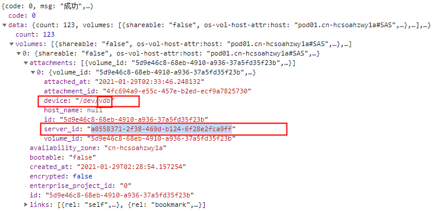

#### 开发环境

http://172.20.12.92:8100/

#### 调试

1. 安徽电信环境 test 账号下的资源

2. 对应时间戳可以先从可以拉到监控的时间调试

3. 云服务器实例ID-盘符名，例如：6f3c6f91-4b24-4e1b-b7d1-a94ac1cb011d-sda(sda为盘符名)  

   server_id就是云服务器实例ID， device里面最后的vdb就是盘符名

   

#### wiki参考

[confluence 原型图](http://confluence.zstack.io/pages/viewpage.action?pageId=96474391)

